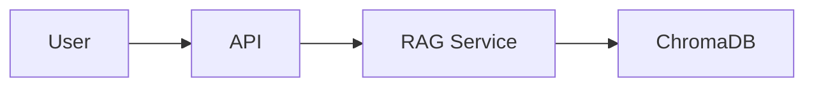

# Documentation Guide — MkDocs

This project uses **MkDocs** with the **Material** theme to generate professional documentation from markdown files. This guide explains how to work with the documentation system.

## What is MkDocs?

MkDocs is a static site generator that transforms markdown files into a beautiful, searchable documentation website with:

- **Navigation sidebar** automatically generated
- **Search functionality** across all pages
- **Professional theme** (Material for MkDocs)
- **Mobile-friendly** responsive design
- **Version control friendly** — docs are just markdown files

## Quick Reference

### View Documentation Locally

```powershell
# Install documentation dependencies
uv sync --group docs

# Serve docs with live reload (default port 8000)
uv run mkdocs serve

# Use custom port to avoid conflicts with the API
uv run mkdocs serve --dev-addr localhost:8001
```

Then open <http://localhost:8001> in your browser. Changes to markdown files will automatically reload!

### Build Static Site

```powershell
# Build HTML site to site/ folder
uv run mkdocs build

# Build with verbose output
uv run mkdocs build --verbose

# Clean build (remove site/ first)
uv run mkdocs build --clean
```

### Deploy to GitHub Pages

```powershell
# Deploy to GitHub Pages (gh-pages branch)
uv run mkdocs gh-deploy

# Deploy with custom commit message
uv run mkdocs gh-deploy --message "Update documentation"
```

**Note:** The project has automated deployment via GitHub Actions, so you typically don't need to run this manually.

## Project Structure

```
Donald-Trump-Rally-Speeches-NLP/
├── docs/                    # All documentation files
│   ├── index.md            # Homepage
│   ├── guides/             # Getting started guides
│   │   ├── quickstart.md
│   │   └── deployment.md
│   ├── howto/              # Task-oriented guides
│   │   ├── testing.md
│   │   ├── entity-analytics.md
│   │   └── documentation.md    # This file
│   └── reference/          # Technical reference
│       ├── architecture.md
│       └── rag-features.md
├── mkdocs.yml              # MkDocs configuration
└── site/                   # Generated HTML (not committed)
```

## How to Add or Edit Documentation

### 1. Edit Existing Pages

Simply edit any `.md` file in the `docs/` folder. If you have `mkdocs serve` running, changes will appear instantly in your browser.

### 2. Add New Pages

**Step 1:** Create a new markdown file in the appropriate folder:
```powershell
# Example: Add a new how-to guide
New-Item docs/howto/my-new-guide.md
```

**Step 2:** Add the page to navigation in `mkdocs.yml`:
```yaml
nav:
  - Home: index.md
  - How-To Guides:
      - Testing: howto/testing.md
      - My New Guide: howto/my-new-guide.md  # Add this line
```

**Step 3:** Preview with `mkdocs serve` and verify it appears in the sidebar.

### 3. Reorganize Navigation

Edit the `nav` section in `mkdocs.yml`:

```yaml
nav:
  - Home: index.md
  
  - Getting Started:
      - Quickstart: guides/quickstart.md
      - Deployment: guides/deployment.md
  
  - How-To Guides:
      - Testing: howto/testing.md
      - Documentation: howto/documentation.md
  
  - Reference:
      - Architecture: reference/architecture.md
      - RAG Features: reference/rag-features.md
```

The order in `mkdocs.yml` determines the order in the sidebar.

## Configuration Reference

### Port Configuration

By default, MkDocs serves on port 8000. To change:

```powershell
# Serve on port 8001
uv run mkdocs serve --dev-addr localhost:8001

# Serve on all interfaces (for network access)
uv run mkdocs serve --dev-addr 0.0.0.0:8001
```

### Theme Customization

Edit `mkdocs.yml` to customize the theme:

```yaml
theme:
  name: material
  palette:
    # Light mode
    - scheme: default
      primary: indigo      # Change primary color
      accent: indigo       # Change accent color
```

**Available colors:** red, pink, purple, deep purple, indigo, blue, light blue, cyan, teal, green, light green, lime, yellow, amber, orange, deep orange

### Add a Logo

1. Add your logo image to `docs/assets/images/`
2. Update `mkdocs.yml`:

```yaml
theme:
  name: material
  logo: assets/images/logo.png
  favicon: assets/images/favicon.ico
```

### Add Custom CSS or JavaScript

1. Create files:
   - `docs/stylesheets/extra.css`
   - `docs/javascripts/extra.js`

2. Update `mkdocs.yml`:

```yaml
extra_css:
  - stylesheets/extra.css

extra_javascript:
  - javascripts/extra.js
```

## Markdown Features

MkDocs with Material theme supports rich markdown features:

### Admonitions (Call-out Boxes)

```markdown
!!! note
    This is a note admonition.

!!! warning
    This is a warning admonition.

!!! tip
    This is a tip admonition.

??? example "Collapsible Example"
    This content is collapsed by default.
```

!!! note
    This is a note admonition.

!!! warning
    This is a warning admonition.

### Code Blocks with Syntax Highlighting

````markdown
```python
def hello_world():
    print("Hello, World!")
```

```bash
uv run pytest
```
````

### Tabbed Content

```markdown
=== "Python"
    ```python
    print("Hello from Python")
    ```

=== "PowerShell"
    ```powershell
    Write-Host "Hello from PowerShell"
    ```
```

=== "Python"
    ```python
    print("Hello from Python")
    ```

=== "PowerShell"
    ```powershell
    Write-Host "Hello from PowerShell"
    ```

### Task Lists

```markdown
- [x] Completed task
- [ ] Incomplete task
- [ ] Another task
```

- [x] Completed task
- [ ] Incomplete task
- [ ] Another task

### Tables

```markdown
| Feature | Supported |
|---------|-----------|
| Search  | ✅        |
| Mobile  | ✅        |
| Dark Mode | ✅      |
```

| Feature | Supported |
|---------|-----------|
| Search  | ✅        |
| Mobile  | ✅        |
| Dark Mode | ✅      |

### Mermaid Diagrams

````markdown

````


## Deployment

### Automated Deployment (Recommended)

The project includes a GitHub Action that automatically deploys documentation to GitHub Pages when you push to the `main` branch.

**How it works:**
1. You push changes to `main`
2. GitHub Actions builds the docs
3. Deploys to GitHub Pages automatically
4. Live at: https://justakris.github.io/Donald-Trump-Rally-Speeches-NLP/

**Configuration:** See `.github/workflows/deploy-docs.yml`

### Manual Deployment

If you need to deploy manually:

```powershell
# Deploy to GitHub Pages
uv run mkdocs gh-deploy
```

This command:
1. Builds the site (`mkdocs build`)
2. Commits the `site/` folder to the `gh-pages` branch
3. Pushes to GitHub

**Note:** Ensure you have push access to the repository.

## Troubleshooting

### Port Already in Use

If port 8000 is already in use by your API:

```powershell
uv run mkdocs serve --dev-addr localhost:8001
```

### "Page not found" in Sidebar

Check `mkdocs.yml` navigation and ensure:
- The file path is correct (relative to `docs/`)
- The file exists
- The file has a `.md` extension

### Changes Not Appearing

1. Check terminal for build errors
2. Hard refresh browser (Ctrl+Shift+R)
3. Restart `mkdocs serve`

### Build Warnings

```
WARNING - Doc file 'path/to/file.md' contains a link to 'broken-link.md'
```

This means you have a broken internal link. Fix the link or remove it.

### Images Not Loading

Ensure images are in `docs/` folder and use relative paths:

```markdown

```

## Best Practices

### 1. Organize by Purpose

- **`guides/`** — Getting started, tutorials
- **`howto/`** — Task-oriented guides (how to do X)
- **`reference/`** — Technical specs, API docs, architecture

### 2. Use Clear Titles

Good: `# Testing Guide — pytest and Coverage`
Bad: `# Testing`

### 3. Add Metadata

At the top of each page, you can add metadata:

```yaml
---
title: Testing Guide
description: How to run tests and check coverage
---
```

### 4. Link Between Pages

Use relative links to link between docs:

```markdown
See the [Quickstart Guide](../guides/quickstart.md) for setup instructions.
```

### 5. Keep Navigation Flat

Avoid deeply nested navigation (max 2-3 levels).

### 6. Test Before Committing

Always run `mkdocs build` before committing to catch broken links and errors:

```powershell
uv run mkdocs build --strict
```

The `--strict` flag turns warnings into errors.

## CI/CD Integration

### GitHub Actions Workflow

The project includes automated documentation deployment. See `.github/workflows/deploy-docs.yml`:

```yaml
name: Deploy Documentation

on:
  push:
    branches: [main]
    paths:
      - 'docs/**'
      - 'mkdocs.yml'

jobs:
  deploy:
    runs-on: ubuntu-latest
    steps:
      - uses: actions/checkout@v4
      - uses: actions/setup-python@v5
      - run: pip install mkdocs-material
      - run: mkdocs gh-deploy --force
```

### Triggers

Documentation deploys automatically when:
- You push to `main`
- Changes are in `docs/` folder or `mkdocs.yml`

## Resources

- **MkDocs Documentation:** https://www.mkdocs.org/
- **Material for MkDocs:** https://squidfunk.github.io/mkdocs-material/
- **Markdown Guide:** https://www.markdownguide.org/
- **Live Documentation:** https://justakris.github.io/Donald-Trump-Rally-Speeches-NLP/

## Summary

**To work with docs:**
1. Edit markdown files in `docs/`
2. Run `uv run mkdocs serve --dev-addr localhost:8001` to preview
3. Commit and push to `main`
4. GitHub Actions deploys automatically

**Need help?** Open an issue on GitHub or check the MkDocs documentation.
