# System Architecture

This document provides a comprehensive overview of the Trump Speeches NLP Chatbot API architecture, including system components, data flows, and deployment strategies.

## Table of Contents

- [High-Level Architecture](#high-level-architecture)
- [Component Architecture](#component-architecture)
- [RAG Pipeline](#rag-pipeline)
- [Data Flow](#data-flow)
- [API Architecture](#api-architecture)
- [Deployment Architecture](#deployment-architecture)
- [Technology Stack](#technology-stack)
- [Scalability Considerations](#scalability-considerations)

---

## High-Level Architecture

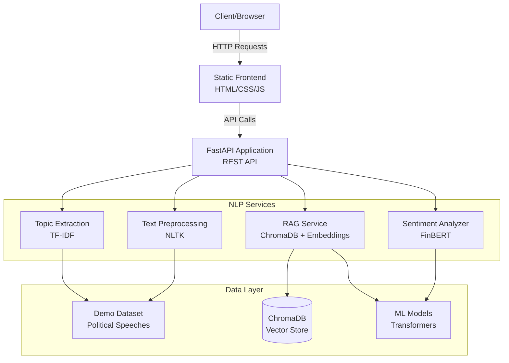

---

## Component Architecture

### 1. **API Layer** (`src/api.py`)

FastAPI application serving as the main entry point.

**Responsibilities:**
- HTTP request handling
- Input validation (Pydantic models)
- Error handling and logging
- CORS middleware
- Static file serving
- Service orchestration

**Endpoints:**
- `/analyze/sentiment` - Sentiment analysis
- `/analyze/words` - Word frequency analysis
- `/analyze/topics` - Topic extraction
- `/analyze/ngrams` - N-gram analysis
- `/text/clean` - Text preprocessing
- `/rag/ask` - RAG question answering
- `/rag/search` - Semantic search
- `/rag/stats` - Collection statistics
- `/rag/index` - Document indexing
- `/speeches/stats` - Dataset statistics
- `/speeches/list` - List all speeches
- `/health` - Health check

### 2. **Sentiment Analysis** (`src/models.py`)

Transformer-based sentiment classification using FinBERT.

**Key Features:**
- Pre-trained FinBERT model (ProsusAI/finbert)
- Automatic text chunking for long documents
- Confidence scoring
- Three-class classification (positive/negative/neutral)

**Processing Flow:**
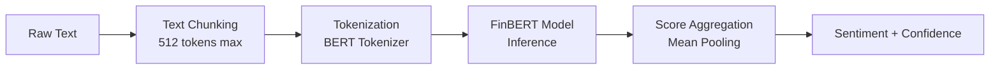

### 3. **RAG Service** (`src/rag_service.py`)

Advanced Retrieval-Augmented Generation for intelligent question answering.

**Components:**
- **Vector Store:** ChromaDB with persistent SQLite storage
- **Embeddings:** sentence-transformers (all-mpnet-base-v2, 768 dimensions)
- **Hybrid Search:** Semantic (dense) + BM25 (sparse) retrieval
- **Reranking:** Cross-encoder for precision optimization
- **Text Splitter:** LangChain RecursiveCharacterTextSplitter
- **Chunking:** 2048 chars with 150 char overlap (~512-768 tokens)
- **LLM:** Google Gemini for answer generation

**Capabilities:**
- Document loading and indexing with progress tracking
- Hybrid semantic + keyword search
- Multi-factor confidence scoring
- Entity extraction and analytics
- Sentiment analysis for entities
- Context-aware answer generation with Gemini

### 4. **Text Preprocessing** (`src/preprocessing.py`)

Text cleaning and normalization utilities.

**Functions:**
- Stopword removal (NLTK)
- Tokenization
- Special character removal
- URL removal
- N-gram extraction

### 5. **Utilities** (`src/utils.py`)

Data loading and analysis helpers.

**Functions:**
- Speech loading from directory
- Word frequency statistics
- Topic extraction (TF-IDF)
- Dataset statistics calculation

---

## RAG Pipeline

Detailed architecture of the Retrieval-Augmented Generation system.

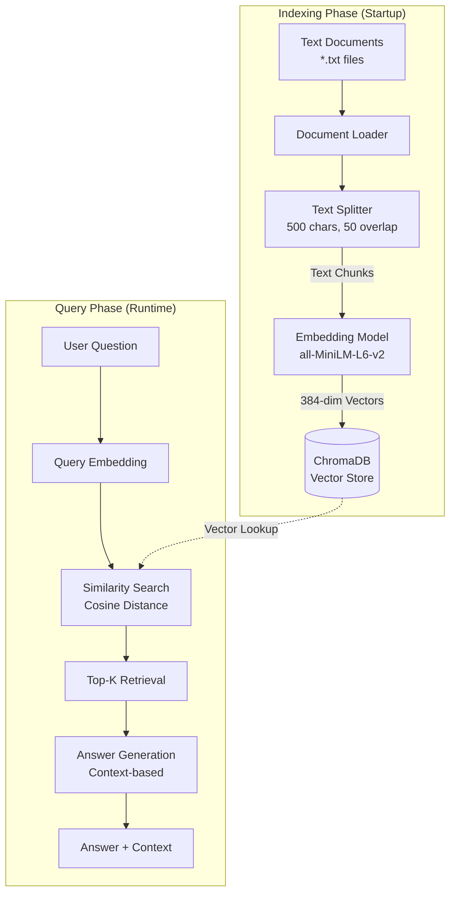

### RAG Workflow Details

**1. Indexing (One-time or on-demand):**
```python
1. Load documents from directory
2. Split into chunks (RecursiveCharacterTextSplitter)
   - chunk_size: 2048 characters (~512-768 tokens)
   - chunk_overlap: 150 characters (~100-150 tokens)
3. Generate embeddings (sentence-transformers)
   - Model: all-mpnet-base-v2
   - Dimension: 768
4. Store in ChromaDB with metadata:
   - source: filename
   - chunk_index: position in document
   - total_chunks: document length
```

**2. Querying:**
```python
1. Receive question from user
2. Extract entities from question (capitalized words)
3. Generate question embedding (same model)
4. Hybrid search:
   a. Semantic search: cosine similarity on embeddings
   b. BM25 search: keyword matching
   c. Combine results with configurable weights
5. Cross-encoder reranking for precision
6. Retrieve top-k most relevant chunks (default k=5, max k=15)
7. Calculate multi-factor confidence score:
   - Retrieval quality (40%): semantic similarity
   - Score consistency (25%): low variance = higher confidence
   - Coverage (20%): number of supporting chunks
   - Entity coverage (15%): mention frequency in results
8. Generate entity statistics (mentions, sentiment, associations)
9. Build context-aware prompt with entity focus
10. Generate answer using Gemini LLM
11. Return answer with:
    - Generated text
    - Confidence score and explanation
    - Supporting context chunks
    - Source attribution
    - Entity analytics (if applicable)
```

**3. Confidence Scoring:**

Multi-factor calculation combining:
- **Retrieval Quality (40%):** Average semantic similarity (0-1)
- **Consistency (25%):** Score variance (low variance = high confidence)
- **Coverage (20%):** Number of supporting chunks (normalized)
- **Entity Coverage (15%):** % of chunks mentioning query entities

**Confidence Levels:**
- **High:** combined_score ≥ 0.7
- **Medium:** 0.4 ≤ combined_score < 0.7
- **Low:** combined_score < 0.4

---

## Data Flow

### Sentiment Analysis Flow

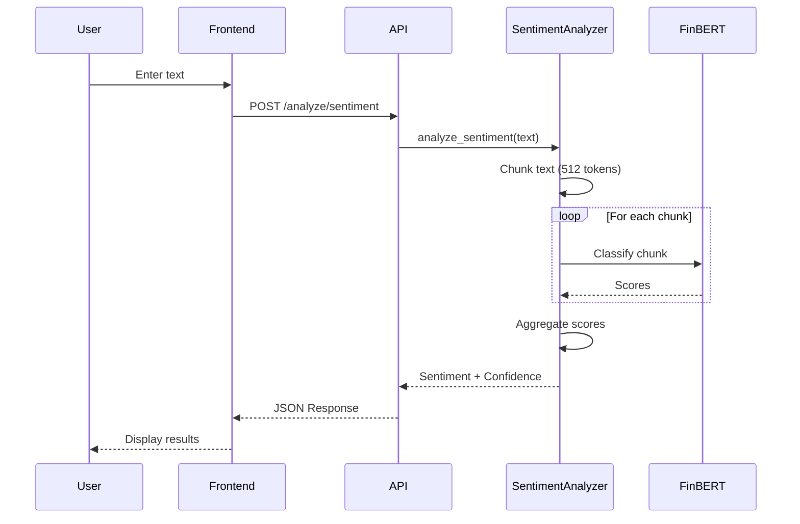

### RAG Question Answering Flow

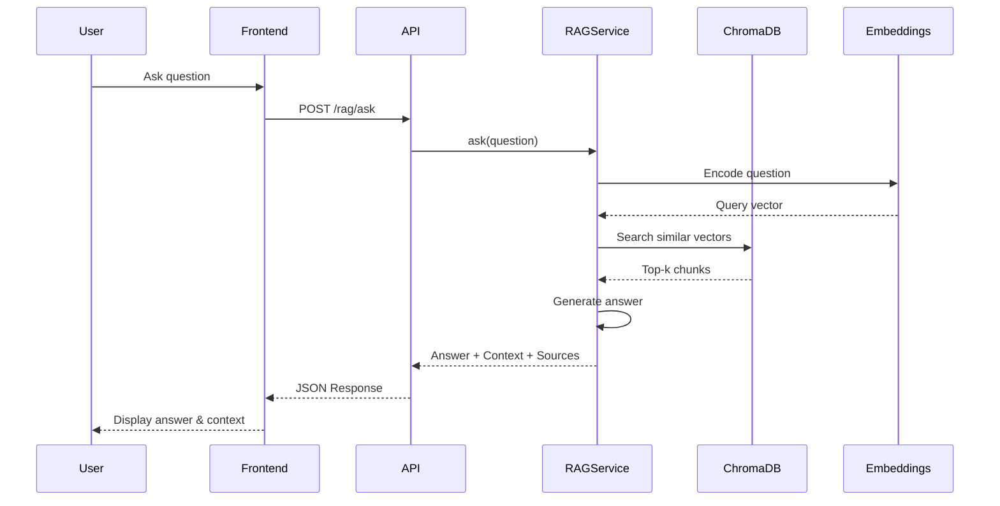

---

## API Architecture

### Request/Response Models (Pydantic)

```python
# Input Models
TextInput
NGramRequest
RAGQueryRequest
RAGSearchRequest

# Response Models
SentimentResponse
WordFrequencyResponse
TopicResponse
StatsResponse
RAGAnswerResponse
RAGStatsResponse
```

### Middleware Stack

```
User Request
    ↓
CORS Middleware (allow all origins in dev)
    ↓
FastAPI Routing
    ↓
Pydantic Validation
    ↓
Endpoint Handler
    ↓
Business Logic (Services)
    ↓
Response Serialization
    ↓
HTTP Response
```

### Error Handling Strategy

```python
try:
    # Business logic
except SpecificError:
    # Handle known errors
    raise HTTPException(status_code=4xx)
except Exception as e:
    # Log unexpected errors
    logger.error(f"Error: {e}")
    raise HTTPException(status_code=500)
```

---

## Deployment Architecture

### Docker Multi-Stage Build

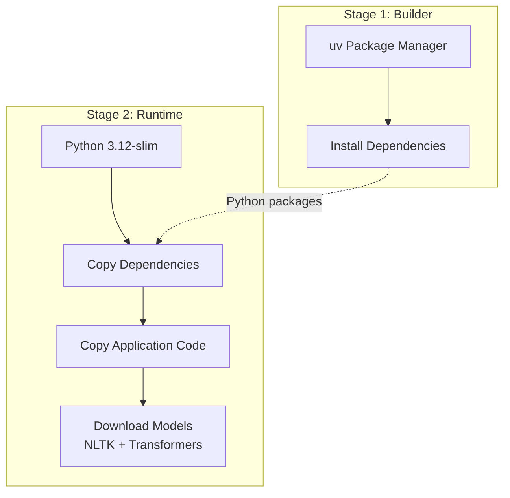

### Deployment Options

#### Option 1: Render (via Docker Hub)

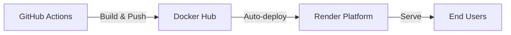

**Flow:**
1. Push to `main` branch
2. GitHub Actions builds Docker image
3. Push to Docker Hub (`trump-speeches-nlp-chatbot:latest`)
4. Render detects new image
5. Render pulls and deploys
6. Health check `/health`

#### Option 2: Azure Web App

**Via ACR:**
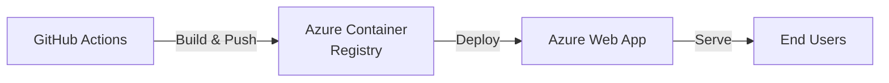

**Via Docker Hub:**
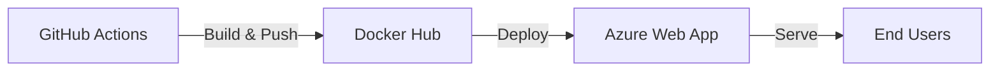

### CI/CD Pipeline

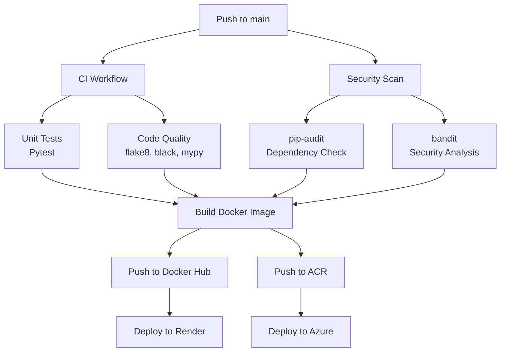

---

## Technology Stack

### Core Technologies

| Layer | Technology | Purpose |
|-------|-----------|---------|
| **API Framework** | FastAPI 0.116+ | High-performance async API |
| **Web Server** | Uvicorn | ASGI server |
| **LLM Integration** | Google Gemini 2.5 Flash | Answer generation |
| **ML Framework** | PyTorch 2.5+ | Deep learning backend |
| **NLP Library** | Transformers 4.57+ | Pre-trained models |
| **Text Processing** | NLTK 3.9+ | Tokenization, stopwords |
| **Vector DB** | ChromaDB 0.5+ | Persistent embeddings storage |
| **Embeddings** | sentence-transformers 3.3+ | Semantic embeddings (MPNet) |
| **Reranking** | Cross-encoder | Precision optimization |
| **Keyword Search** | rank-bm25 | Sparse retrieval |
| **RAG Framework** | LangChain 0.3+ | Text splitting utilities |

### Supporting Technologies

| Category | Technology | Version |
|----------|-----------|---------|
| **Dependency Mgmt** | uv | Latest |
| **Containerization** | Docker | Latest |
| **CI/CD** | GitHub Actions | - |
| **Testing** | pytest | 8.3+ |
| **Code Quality** | black, flake8, mypy, isort | Latest |
| **Security** | pip-audit, bandit | Latest |

### Model Details

| Model | Task | Source | Size |
|-------|------|--------|------|
| **Gemini 2.5 Flash** | Answer Generation | Google AI | API-based |
| **FinBERT** | Sentiment Analysis | ProsusAI/finbert | ~440MB |
| **all-mpnet-base-v2** | Embeddings (768d) | sentence-transformers | ~420MB |
| **ms-marco-MiniLM** | Reranking | cross-encoder | ~80MB |

---

## Scalability Considerations

### Current Architecture

- **Compute:** Single-instance deployment
- **Storage:** Local filesystem + ChromaDB
- **Concurrency:** Async FastAPI (handles concurrent requests)

### Scaling Strategies

#### 1. Horizontal Scaling

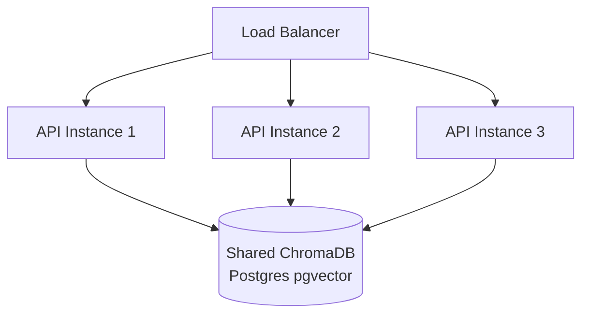

**Required Changes:**
- Replace ChromaDB with pgvector (Postgres) or Pinecone
- Use shared model storage (S3/Azure Blob)
- Add Redis for caching

#### 2. Vertical Scaling

**Current Requirements:**
- RAM: ~2GB (models + API)
- CPU: 1-2 cores
- Storage: ~1GB (models + data)

**Optimized for:**
- RAM: 4-8GB for concurrent requests
- CPU: 4+ cores for parallel processing
- Storage: 5GB+ for larger datasets

#### 3. Performance Optimizations

**Already Implemented:**
- Multi-stage Docker builds
- Model pre-loading on startup
- Async request handling
- Efficient text chunking

**Future Improvements:**
- Model quantization (reduce size)
- GPU acceleration (CUDA support)
- Response caching (Redis)
- CDN for static files
- Database connection pooling
- Background task queues (Celery)

### Resource Usage

| Component | RAM | CPU | Storage |
|-----------|-----|-----|---------|
| FastAPI | ~100MB | Low | - |
| FinBERT | ~1GB | Medium | 440MB |
| all-MiniLM-L6-v2 | ~200MB | Low | 80MB |
| ChromaDB | ~100MB | Low | Variable |
| NLTK Data | ~50MB | Low | 50MB |
| **Total** | **~2GB** | **1-2 cores** | **~1GB** |

---

## Security Architecture

### Current Security Measures

1. **Dependency Scanning:** pip-audit (weekly)
2. **Code Analysis:** bandit
3. **Input Validation:** Pydantic models
4. **Non-root Container:** User `appuser` (UID 1000)
5. **Health Checks:** `/health` endpoint

### Production Recommendations

1. **Authentication:** Add API key validation
2. **Rate Limiting:** Implement per-IP limits
3. **HTTPS:** Use reverse proxy (Nginx)
4. **CORS:** Restrict to specific origins
5. **Secrets Management:** Use environment variables
6. **Logging:** Centralized logging (ELK stack)
7. **Monitoring:** Prometheus + Grafana

---

## Monitoring & Observability

### Recommended Metrics

**Application Metrics:**
- Request count (by endpoint)
- Response time (p50, p95, p99)
- Error rate (4xx, 5xx)
- Model inference time

**System Metrics:**
- CPU usage
- Memory usage
- Disk I/O
- Network I/O

**Business Metrics:**
- Total analyses performed
- Most used endpoints
- Average sentiment scores
- RAG query accuracy

### Implementation Example (Prometheus)

```python
from prometheus_client import Counter, Histogram

request_count = Counter('api_requests_total', 'Total requests', ['endpoint'])
request_duration = Histogram('api_request_duration_seconds', 'Request duration')
```

---

## Future Architecture Enhancements

### 1. Advanced RAG Features

- **Query Caching:** Redis layer for common questions
- **Multi-modal:** Support PDFs, images, audio transcripts
- **Temporal Analysis:** Sentiment trends over time
- **Entity Relationships:** Knowledge graph visualization
- **Fine-tuned Embeddings:** Domain-specific embedding models

### 2. Performance Optimizations

- **Async Processing:** Background tasks for entity analytics
- **GPU Acceleration:** CUDA support for faster inference
- **Model Quantization:** Reduce model sizes
- **Response Streaming:** WebSocket support for real-time answers

### 3. Enhanced NLP

- **Proper NER:** spaCy or Hugging Face transformers for entity extraction
- **Text Summarization:** Automatic speech summarization
- **Topic Modeling:** LDA or BERTopic for theme discovery
- **Fact Extraction:** Structured information extraction

### 4. Deployment & Scale

- **Kubernetes:** Container orchestration
- **Auto-scaling:** Based on request volume
- **Multi-region:** Global deployment
- **CDN:** Static asset delivery

---

## Development Workflow

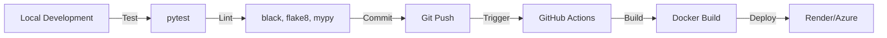

---

## References

- [FastAPI Documentation](https://fastapi.tiangolo.com/)
- [Transformers Documentation](https://huggingface.co/docs/transformers)
- [ChromaDB Documentation](https://docs.trychroma.com/)
- [LangChain Documentation](https://python.langchain.com/)
- [Docker Best Practices](https://docs.docker.com/develop/dev-best-practices/)

---

**Last Updated:** October 2025  
**Version:** 0.1.0  
**Maintainer:** Kristiyan Bonev
